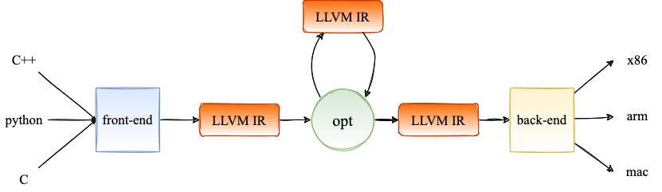

LLVM编译流程
LLVM IR是LLVM项目的核心，对于每个编译器而言，为了方便对不同的高级语言进行优化以及代码生成（codegen），其会根据目标语言产生统一的中间表示（Intermediate Representation，IR），这种中间表示既与源语言无关，也与目标架构无关。随后只需要在统一的IR上实现一套相同的pass即可，避免了为不同的高层级语言设计多套不同的pass和codegen。整个编译的流程可以近似看作下图1所示。

图2 编译器的编译流程示意图     
  

其中，不同的高级语言会通过前端的处理（词法分析、语法分析、语义分析等）生成特定的数据结构（如抽象语法树），随后这些数据结构会被发射（emit）成相应的LLVM IR进行独立于源语言和目标架构的统一表示。接下来，LLVM opt会对这些IR执行指定的pass，常见的如Dead Code Elimination，Loop Invariant Code Motion等。每个pass的输入都是LLVM IR，输出同样也是LLVM IR。最后，经过优化的LLVM IR会送入编译器后端，被转换为Selection Directed Acyclic Graph（Selection DAG），并最终发射为目标架构的汇编指令。